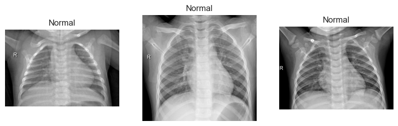
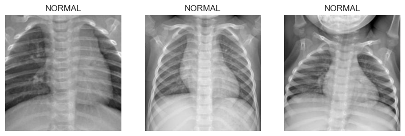

# SC1015 Penumonia Detection ඞ

## **Introduction**

Our team has observed that the number of people coughing around us is increasing gradually, especially after COVID. The COVID-19 pandemic has resulted in a global increase in lung infections. The lungs are an essential part of the body, and any infection associated with them should be treated immediately. Pneumonia is one of the diseases on the rise due to COVID-19. With hospitals already filled with patients, it's crucial to detect and diagnose pneumonia in the early stages.Early diagnosis and treatment can prevent complications and help reduce the burden on healthcare systems. 

The global increase in pneumonia cases due to COVID-19 has resulted in a strain on hospital resources, such as doctor's time and wards.Detecting pneumonia can be challenging as its symptoms can be similar to other respiratory infections.
Even with the help of scans and data, doctors are subject to human error and may take time to diagnose pneumonia accurately.Misdiagnosis or delayed diagnosis can lead to complications and a further burden on healthcare systems.
Early detection and treatment of pneumonia can help reduce the burden on hospitals and improve patient outcomes.

Therefore, our team decided to source our dataset from Kaggle which landed us on the [pneumonia dataset (7 March 2023)](https://www.kaggle.com/datasets/paultimothymooney/chest-xray-pneumonia). This dataset contains 5,863 X-Ray images (JPEG) and 2 categories (Pneumonia/Normal).

This is where our model to detect pneumonia using X-Rays comes into the picture to drastically improve the accuracy and efficiency of the diagnostic process. This saves significant cost and time and it enables early detection which can prevent the progression of the disease and reduce the risk of complications

Hence, our team problem definition develop a deep learning model that can accurately classify chest X-ray images as either showing signs of pneumonia or not. Addtionally, we will check if augmentation improves the accuracy of our model

## **Paths**

    SC1015_pneumonia_detection/
    ├── main_source_code/
    │   ├── source.ipynb
    │   └── non_resampled_source.ipynb
    ├── readmeAssets/
    │   ├── originalDatasetImage.png
    │   └── resizeImages.png
    ├── Conclusion.ipynb
    ├── ExploratoryDataAnalysis.ipynb
    ├── ModelBuilding(Oversampling).ipynb
    ├── ModelBuilding(Undersampling).ipynb
    └── README.MD

## **Main Source code**

The jupyter notebook in this folder is an unsplit version. Source.ipynb holds the code and model for the undersampling and oversampling of the dataset while non_resampled_source is the team experimenting with the original dataset wihtout any sampling done to it.

There are two jupyter notebook named:
1. source.ipynb 
2. non_resampled_source.ipynb

**source.ipynb is the main notebook that include all EDA and model building** whereas non_resampled_source.ipynb was my first trail run with the dataset

## **Exploratory Data Analysis**

For EDA,the team checked for extension to ensure that all the images are suitable for the model to be proccessed as an appropriate input. We resized and crop the images so that the most prominent feature of the image is captured and standardizing the image helps with the training time.

### Original 

### Resized

## **Conclusion**

1. Augmenting minute difference in images of different classes can disrupt the performance of the model leading to poor recall, precision and accuracy.

2. DenseNet and ResNet both did pretty similar in terms of performance

3. Undersampling and randomizing the dataset use to train and test can help to prevent biases

## **Recommendation**
1. Augment both classes instead of one class followed by shuffling them and undersample to prevent a repeat of images.

2. Explore other nerual network model that is more tailored towards this kind of images

3. Explore futher into "EDA" on images such as getting the mean of the array and such.

## **Reflection**
1. Discovering the world of transfer learning makes training easier

2. Dealing with imbalanced datasets through undersampling and oversampling from augmentation

3. Understanding precision and recall.

## **Contributors**

Three musketeers that did a tad bit of everything hence our load are pretty equal in all aspect of this project.

1. Anat

2. Akhilesh

3. Sheng Yang

## **References** 
1. https://www.ncbi.nlm.nih.gov/pmc/articles/PMC8423280/
2. https://cv-tricks.com/keras/understand-implement-resnets/
3. https://journals.plos.org/plosone/article?id=10.1371/journal.pone.0256630
4. https://neptune.ai/blog/image-classification-tips-and-tricks-from-13-kaggle-competitions
5. https://github.com/jeffheaton/t81_558_deep_learning/blob/master/install/tensorflow-install-mac-metal-jan-2023.ipynb

